# Deverino Agentic Harness — Architecture Diagrams

> **Snapshot date:** 2026-05-21  
> **Context-map cycle:** 166 · **Entries:** 8 · **Corpus:** `deverino:codebase`  
> **Source:** `deverino_react.acdl`, `harness.yaml`, `harness_poc/` source tree

---

## 1. System Overview

```mermaid
graph TD
    subgraph UI["User Interfaces"]
        TUI["Textual TUI<br/>(tui.py)<br/>vim_enabled: true"]
        CLI["CLI<br/>(cli.py)<br/>acdl commands"]
        API["API /chat<br/>(api/chat.py)<br/>FastAPI"]
    end

    UI --> AF

    AF["**App Factory**<br/>(app_factory.py)<br/>Wires: config, LLM, DB,<br/>event store, context map,<br/>skill catalog, tool registry<br/>Injects sys.context_map @ L118-124"]

    AF --> LOOP

    subgraph LOOP["Streaming ReAct Tool Loop (pydantic_ai)"]
        direction TB

        subgraph SBLOCK["S: Block — System Prompt (5-layer concatenation)"]
            direction TB
            L1["Layer 1: SoulCharter<br/>Source: SOUL.md<br/>Agent identity & principles"]
            L2["Layer 2: StateBlock<br/>Source: state.py → build_state_context()<br/>project_state (durable) + session_state (ephemeral)"]
            L3{"Layer 3: ContextMapBlock<br/>(CONDITIONAL)<br/>If sys.context_map ≠ none"}
            L4["Layer 4: SkillCatalogBlock<br/>Source: skill_catalog.py<br/>Progressive disclosure: summary → full"]
            L5["Layer 5: ToolPolicy + Budget + Truncation<br/>max 10 tool rounds · 3 semble/run<br/>24000 tokens / 6 turns · drop oldest"]

            L1 --> L2 --> L3 --> L4 --> L5
        end

        subgraph UBLOCK["U: Block — Conversation History"]
            direction TB
            HIST["ForEach(@t: range(max(1, @T-6), @T))<br/>ConversationTurn&#91;@t&#93;"]
            CURR["U: env.user_input&#91;@T&#93;<br/>(current turn)"]
            HIST --> CURR
        end

        subgraph TCORE["Tool Loop Core"]
            direction LR
            LLM["LLM<br/>glm-5.2<br/>provider: glm"]
            TL["Tool Loop<br/>max 10 rounds<br/>per-tool dedup"]
            TE["Tool Execution<br/>37 tools<br/>12000 char max"]
            OBS["Observation<br/>fed back as U: role"]

            LLM <--> TL --> TE --> OBS --> LLM
        end

        SBLOCK --> TCORE
        UBLOCK --> TCORE
    end

    AF --> PEEK

    subgraph PEEK["Context Map Materialization Pipeline (PEEK)"]
        direction LR
        ES["Event Store<br/>(PostgreSQL)<br/>Typed BaseEvent subclasses"]
        DIST["Distiller<br/>(LLM: glm-5.2)<br/>3 retries, 120s timeout<br/>Template: distiller_v2"]
        CART["Cartographer<br/>(DETERMINISTIC Python)<br/>4 ops: dedup, score, decay, budget"]
        CM["Context Map<br/>(PostgreSQL + pgvector)<br/>cycle 166 · 8 entries"]

        ES -->|"raw events"| DIST
        DIST -->|"DistillerEntry&#123;key,type,summary,src_ids,tags&#125;"| CART
        CART -->|"MapEntry&#91;&#93; fits 1024 tokens"| CM
    end

    CM -.->|"injected into S: block Layer 3"| L3

    style AF fill:#e1f5fe,stroke:#01579b,stroke-width:2px
    style LLM fill:#fff3e0,stroke:#e65100,stroke-width:2px
    style DIST fill:#fce4ec,stroke:#880e4f,stroke-width:2px
    style CART fill:#e8f5e9,stroke:#1b5e20,stroke-width:2px
    style CM fill:#f3e5f5,stroke:#4a148c,stroke-width:2px
    style L3 fill:#fffde7,stroke:#f57f17,stroke-width:2px
```

---

## 2. Two Loop Variants

```mermaid
graph LR
    subgraph CHAT["DeverinoChatLoop&#91;@T&#93;<br/>(pydantic_runtime.py)"]
        direction TB
        C_ENV["env: user_input, retrieved_chunks,<br/>web_results, codebase_matches,<br/>tool_results, memory_hits"]
        C_SYS["sys: soul_charter, project_state,<br/>session_state, context_map,<br/>available_skills, tool_policy"]
        C_RESP["resp: answer, reasoning, tool_calls,<br/>observations, token_usage"]
    end

    subgraph GOAL["DeverinoGoalLoop&#91;@T, $max_iterations&#93;<br/>(goal_runner.py)"]
        direction TB
        G_ENV["env: + goal_objective, max_iterations,<br/>max_tokens, max_seconds"]
        G_SYS["sys: + event_history (BaseEvent&#91;&#93;),<br/>iteration, total_tokens_used"]
        G_RESP["resp: + is_complete (bool),<br/>final_answer (string)"]
    end

    CHAT -->|"wraps into"| GOAL

    GOAL -->|"after each cycle"| EVAL["GoalEvaluationTurn<br/>U: &#91;evaluate_goal&#93; Is the objective complete?<br/>A: GOAL_EVAL_RESPONSE"]

    EVAL -->|"is_complete = true"| HALT["HALT → return final_answer"]
    EVAL -->|"is_complete = false"| CONTINUE["Continue next action"]
    CONTINUE --> GOAL

    style CHAT fill:#e3f2fd,stroke:#1565c0
    style GOAL fill:#fce4ec,stroke:#c62828
    style HALT fill:#ffebee,stroke:#b71c1c,stroke-width:2px
```

---

## 3. System Prompt Assembly (ACDL S: Block)

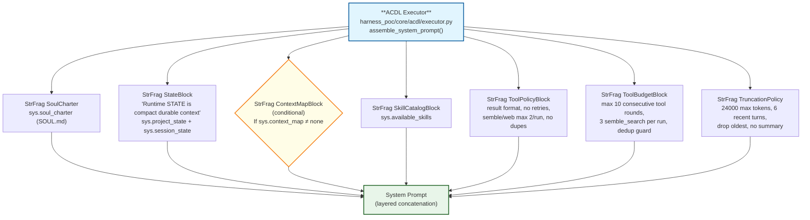

---

## 4. ConversationTurn Fragment Structure

```mermaid
graph TD
    subgraph CT["RoleFrag ConversationTurn&#91;@t&#93;"]
        direction TB

        subgraph U_TURN["User Input"]
            U_IN{"If env.user_input&#91;@t&#93; ≠ none"}
            U_IN -->|"yes"| U_MSG["U: env.user_input&#91;@t&#93;"]
        end

        subgraph A_TURN["Assistant Response"]
            A_TC{"If resp.tool_calls&#91;@t&#93; ≠ none"}
            A_TC -->|"yes"| A_MSG["A: resp.reasoning&#91;@t&#93;<br/>+ ForEach&#40;call&#41; ACTION_RECORD&#40;call&#41;"]

            A_ANS{"If resp.answer&#91;@t&#93; ≠ none"}
            A_ANS -->|"yes"| A_TXT["A: resp.answer&#91;@t&#93;"]
        end

        subgraph O_TURN["Tool Observations"]
            O_CHK{"If resp.observations&#91;@t&#93; ≠ none"}
            O_CHK -->|"yes"| O_MSG["ForEach&#40;obs&#41;<br/>U: OBSERVATION_RECORD&#40;obs&#41;"]
        end

        U_TURN --> A_TURN --> O_TURN
    end

    style U_TURN fill:#e3f2fd,stroke:#1565c0
    style A_TURN fill:#fff3e0,stroke:#e65100
    style O_TURN fill:#e8f5e9,stroke:#1b5e20
```

---

## 5. Context Map Materialization Pipeline (PEEK)

```mermaid
graph TD
    subgraph INPUT["Input Layer"]
        direction LR
        EVT["Event Store<br/>(PostgreSQL: events table)"]
        EVT_TYPES["Typed BaseEvent subclasses:<br/>SkillCalled · SkillCompleted · ToolErrored<br/>LLMTextEmitted · GoalEvaluated"]
        EVT --- EVT_TYPES
    end

    subgraph DISTILL["Distiller (LLM Call)"]
        direction TB
        D_CFG["Model: glm-5.2<br/>Retries: 3<br/>Timeout: 120s<br/>Template: distiller_v2"]
        D_OUT["**Output: DistillerEntry&#91;&#93;**<br/>&#123; key, observation_type, summary,<br/>source_event_ids, tags &#125;"]
        D_VAL["Validation: Pydantic schema<br/>Invalid → retry w/ error feedback<br/>All fail → safe fallback (last-good map)"]
        D_CFG --> D_OUT --> D_VAL
    end

    subgraph CART["Cartographer (Deterministic Python)"]
        direction TB

        OP1["**Op 1: Dedup & Merge**<br/>Index by key → replace if newer src_ids<br/>Otherwise insert"]
        OP2["**Op 2: Priority Scoring**<br/>base_weight&#91;type&#93; + recency_bonus × timestamp"]
        OP3["**Op 3: Staleness Decay**<br/>penalty per missed cycle<br/>below floor → remove"]
        OP4["**Op 4: Budget Enforcement**<br/>sort by priority desc<br/>take until 1024 tokens exhausted<br/>evict rest (emit derivation events)"]

        OP1 --> OP2 --> OP3 --> OP4
    end

    subgraph OUTPUT["Context Map"]
        direction TB
        CM_DB["PostgreSQL: context_map table<br/>+ context_map_embeddings (pgvector 384-dim)"]
        CM_META["cycle: 166 · entries: 8<br/>frozen after 3 cycles @ 0.92 CoPT"]
        CM_SECTIONS["Sections:<br/>context_architecture (25%)<br/>parsing_schema (20%)<br/>context_understanding (25%)<br/>context_roadmap (15%)<br/>domain_constants (10%)<br/>reusable_results (5%)"]
        CM_DB --- CM_META --- CM_SECTIONS
    end

    INPUT -->|"raw events max 8000 tokens"| DISTILL
    DISTILL -->|"validated observations"| CART
    CART -->|"MapEntry&#91;&#93; ≤ 1024 tokens"| OUTPUT

    subgraph GATES["Suppression Gates"]
        direction LR
        COPT["**CopT Gate** (copt_gate.py)<br/>event matches map entry w/<br/>materialization_count > 1<br/>AND similarity > 0.92 → SUPPRESS"]
        FREEZE["**Freeze Mechanism**<br/>content_hash stable for 3 cycles<br/>→ freeze 300s (skip materialization)"]
    end

    INPUT -.-> COPT
    COPT -.->|"suppresses redundant events"| DISTILL
    OUTPUT -.->|"content_hash"| FREEZE
    FREEZE -.->|"freezes"| DISTILL

    style DISTILL fill:#fce4ec,stroke:#880e4f,stroke-width:2px
    style CART fill:#e8f5e9,stroke:#1b5e20,stroke-width:2px
    style OUTPUT fill:#f3e5f5,stroke:#4a148c,stroke-width:2px
    style COPT fill:#fff8e1,stroke:#f57f17
    style FREEZE fill:#fff8e1,stroke:#f57f17
```

---

## 6. Priority Weights and Section Assignment

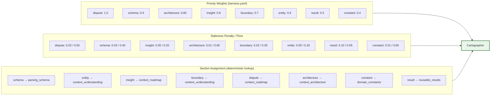

---

## 7. Event Bus and V2 Architecture

```mermaid
graph TD
    subgraph BUS["Event Bus (event_bus.py)"]
        direction TB
        PUB["Pub/Sub<br/>Typed BaseEvent"]
        TYPES["Event Types:<br/>SkillCalled · SkillCompleted<br/>ToolErrored · LLMTextEmitted<br/>GoalEvaluated"]
        PUB --- TYPES
    end

    subgraph SUBS["Subscribers (v2/subscribers/)"]
        direction TB
        LLM_W["LLM Worker<br/>(llm_worker.py)<br/>Handles LLM calls"]
        TOOL_W["Tool Worker<br/>(tool_worker.py)<br/>Executes tool calls"]
        GOAL_E["Goal Evaluator<br/>(goal_evaluator.py)<br/>Evaluates is_complete"]
        CB["Circuit Breaker<br/>(circuit_breaker.py)<br/>Prevents cascading failures"]
        PIPE_R["Pipeline Runner<br/>(pipeline_runner.py)<br/>Runs skill pipelines"]
    end

    subgraph CORE["V2 Core (v2/)"]
        direction TB
        EXEC_ENG["Execution Engine<br/>(execution_engine.py)<br/>Manages ReAct loop lifecycle"]
        WF_ORCH["Workflow Orchestrator<br/>(workflow_orchestrator.py)<br/>Coordinates multi-step workflows"]
        CTX_ENG["Context Engine<br/>(context_engine.py)"]
        AGENT_CFG["Agent Config<br/>(agent_config.py)"]
        WIRING["Wiring<br/>(wiring.py)"]
    end

    subgraph HAND["Handlers (v2/handlers/)"]
        direction TB
        DEL_H["Delegate Task Handler<br/>(delegate_task_handler.py)<br/>Routes sub-tasks to sub-agents"]
    end

    subgraph CONTR["Contracts (v2/contracts/)"]
        direction TB
        CMP_C["Context Map Pipeline<br/>(context_map_pipeline.py)"]
        ER_C["Event Runtime<br/>(event_runtime.py)"]
        SAS_C["Sub-Agent Spawner<br/>(sub_agent_spawner.py)"]
    end

    BUS --> SUBS
    BUS -->|"persist"| ESTORE["Event Store<br/>(event_store.py → PostgreSQL)"]
    SUBS --> CORE
    CORE --> HAND
    CORE --> CONTR

    ESTORE -->|"observable via"| TRACE["trace_session&#40;&#41;"]
    ESTORE -->|"observable via"| FEP["find_error_pattern&#40;&#41;"]

    style BUS fill:#e3f2fd,stroke:#1565c0,stroke-width:2px
    style ESTORE fill:#f3e5f5,stroke:#4a148c
    style EXEC_ENG fill:#e8f5e9,stroke:#1b5e20
```

---

## 8. Tool Surface (37 Tools)

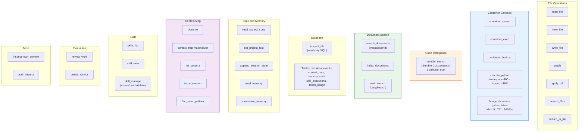

---

## 9. Retrieval and Indexing

```mermaid
graph LR
    subgraph VESPA["Vespa (localhost:8080)"]
        V1["Schema: doc_chunk<br/>Mode: hybrid<br/>Chunk: 1800 chars<br/>Overlap: 200 chars<br/>Hits: 8 default<br/>Timeout: 5s"]
    end

    subgraph DOCIDX["Document Index (document_index.py)"]
        D1["Auto-index: docs/<br/>Ignore: acdl/, node_modules,<br/>.venv, __pycache__<br/>Max file: 50MB<br/>Workers: 1"]
    end

    subgraph SEMBLE["Semble CLI (semble_search)"]
        S1["Semantic code search<br/>over codebase<br/>3 calls/run max"]
    end

    DOCIDX -->|"indexes into"| VESPA
    VESPA -->|"query: search_documents&#40;&#41;"| AGENT["Agent ReAct Loop"]
    SEMBLE -->|"query: semble_search&#40;&#41;"| AGENT

    style VESPA fill:#e3f2fd,stroke:#1565c0
    style SEMBLE fill:#fff3e0,stroke:#e65100
```

---

## 10. Persistence Layer (PostgreSQL)

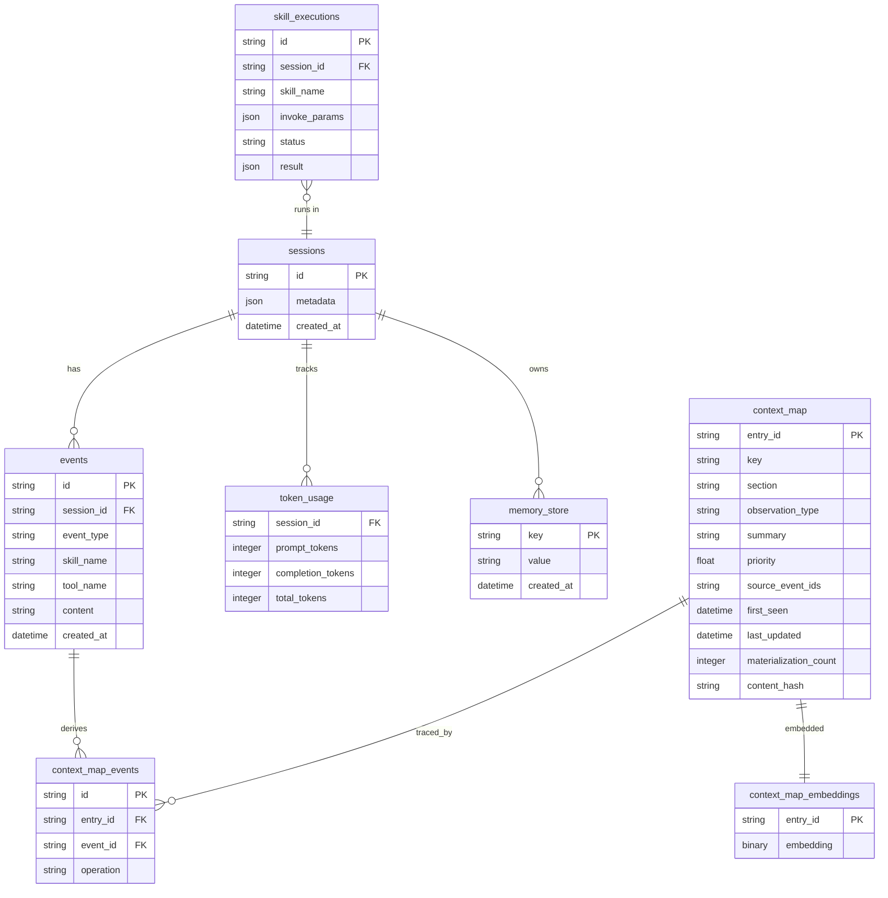

---

## 11. ACDL Toolchain

```mermaid
graph LR
    ACDL_FILE[".acdl file<br/>(deverino_react.acdl)"]

    subgraph PARSE["Parser (acdl/parser.py)"]
        P1["Tokenize"]
        P2["Build AST"]
        P1 --> P2
    end

    subgraph AST["AST (acdl/ast.py)"]
        A1["Fragment definitions<br/>(StrFrag, RoleFrag)"]
        A2["Prompt definitions<br/>(DeverinoChatLoop, DeverinoGoalLoop)"]
        A3["Namespace declarations<br/>(env, sys, resp)"]
    end

    subgraph EXEC["Executor (acdl/executor.py)"]
        E1["assemble_system_prompt&#40;&#41;<br/>Binds sys.* values<br/>Evaluates If/ForEach"]
        E2["S: block = EXECUTABLE<br/>(owns fragment composition)"]
        E3["RoleFrag loop = DESCRIPTIVE<br/>(pydantic-ai runs it)"]
        E1 --> E2
        E1 --> E3
    end

    ACDL_FILE --> PARSE --> AST --> EXEC

    EXEC -->|"system prompt"| RUNTIME["pydantic_ai runtime"]

    subgraph VALIDATE["Validation"]
        V1["uv run harness-poc acdl validate"]
        V2["acdl_inspect tool<br/>(structural summary)"]
    end

    ACDL_FILE -.-> VALIDATE

    style ACDL_FILE fill:#e1f5fe,stroke:#01579b,stroke-width:2px
    style EXEC fill:#e8f5e9,stroke:#1b5e20,stroke-width:2px
```

---

## 12. Observability and Evaluation

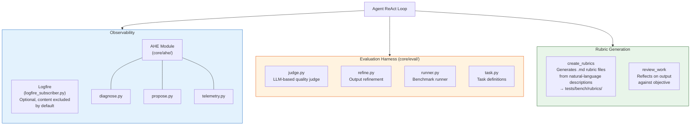

---

## 13. System Skills and Knowledge Skills

```mermaid
graph TD
    subgraph SYS_SKILLS["System Skills (8 — auto-invokable)"]
        direction TB
        SS1["ahe_evolve<br/>Agentic harness evolution"]
        SS2["append_event<br/>Append typed events to store"]
        SS3["consolidate_state<br/>Merge session → project state"]
        SS4["delegate_task<br/>Spawn sub-agent for sub-tasks"]
        SS5["evaluate_goal<br/>Goal loop termination eval"]
        SS6["evaluate_output<br/>Quality eval of agent output"]
        SS7["orchestrate<br/>Multi-skill orchestration"]
        SS8["read_memory<br/>Read shared blackboard"]
    end

    subgraph KNOW_SKILLS["Knowledge Skills (7 — compiled)"]
        direction TB
        KS1["acdl-syntax<br/>ACDL grammar reference"]
        KS2["acdl-tooling<br/>acdl_inspect tool reference"]
        KS3["deterministic-cartographer<br/>Migration plan, PEEK design"]
        KS4["developer-pedagogy<br/>Developer profile"]
        KS5["deverino-react-acdl<br/>Loop ACDL spec"]
        KS6["paper-catalog<br/>Paper inventory"]
        KS7["paper-claim-verification<br/>Citation cross-check"]
    end

    CATALOG["Skill Catalog<br/>(skill_catalog.py → build_skill_catalog&#40;&#41;)<br/>Progressive disclosure:<br/>Tier 1: name + description (summary)<br/>Tier 2: full contracts + templates"]

    SYS_SKILLS --> CATALOG
    KNOW_SKILLS --> CATALOG
    CATALOG -->|"injected into S: block Layer 4"| AGENT2["Agent ReAct Loop"]

    style CATALOG fill:#e1f5fe,stroke:#01579b,stroke-width:2px
    style SYS_SKILLS fill:#e8f5e9,stroke:#1b5e20
    style KNOW_SKILLS fill:#fff3e0,stroke:#e65100
```

---

## 14. End-to-End Data Flow

```mermaid
graph TD
    USER["User Input"] --> APP["App Factory"]
    APP -->|"assemble S: block"| SPROMPT["System Prompt<br/>SOUL + STATE + CTX_MAP + SKILLS + POLICY"]
    APP -->|"assemble U: block"| UHIST["Conversation History<br/>last 6 turns + current input"]

    SPROMPT --> REACT["ReAct Tool Loop"]
    UHIST --> REACT

    REACT -->|"generates"| LLM_CALL["LLM: glm-5.2"]
    LLM_CALL -->|"tool calls"| TOOLS["Tool Execution<br/>(37 tools)"]
    TOOLS -->|"observations"| OBS2["Observations<br/>(U: role, 12K char max)"]
    OBS2 -->|"feed back"| LLM_CALL

    LLM_CALL -->|"final answer"| ANSWER["Response to User"]

    REACT -->|"agent calls"| OBS_TOOL["observe&#40;&#41;<br/>records structural observation"]
    OBS_TOOL --> ESTORE2["Event Store"]
    TOOLS -->|"side effects"| ESTORE2

    ESTORE2 -->|"poll every 30s"| DIST2["Distiller (LLM)"]
    DIST2 -->|"DistillerEntry&#91;&#93;"| CART2["Cartographer (Python)"]
    CART2 -->|"MapEntry&#91;&#93;"| CMAP2["Context Map"]
    CMAP2 -.->|"PEEK injection<br/>into S: block Layer 3"| SPROMPT

    ESTORE2 -->|"CopT gate"| COPT2["Suppress if<br/>similarity > 0.92<br/>and mat_count > 1"]
    COPT2 -.->|"filters"| DIST2

    CMAP2 -->|"content_hash stable<br/>3 cycles"| FREEZE2["Freeze 300s"]
    FREEZE2 -.->|"skip materialization"| DIST2

    style USER fill:#e3f2fd,stroke:#1565c0
    style REACT fill:#fff3e0,stroke:#e65100,stroke-width:2px
    style DIST2 fill:#fce4ec,stroke:#880e4f
    style CART2 fill:#e8f5e9,stroke:#1b5e20,stroke-width:2px
    style CMAP2 fill:#f3e5f5,stroke:#4a148c,stroke-width:2px
    style COPT2 fill:#fff8e1,stroke:#f57f17
    style FREEZE2 fill:#fff8e1,stroke:#f57f17
```

---

## Appendix: Configuration Reference (harness.yaml)

| Section | Key Fields | Values |
|---|---|---|
| **llm** | provider, model | `glm`, `glm-5.2` |
| **runtime** | chat_history_max_tokens | 24000 |
| | chat_history_recent_turns | 6 |
| | tool_result_max_chars | 12000 |
| | materializer_poll_interval | 30s |
| | materializer_max_event_tokens | 8000 |
| | materializer_token_budget | 1024 |
| | materializer_freeze_threshold | 3 |
| | materializer_freeze_seconds | 300 |
| | materializer_copt_threshold | 0.92 |
| | default_container_image | `deverino-python:latest` |
| | max_harness_containers | 5 |
| | container_ttl_seconds | 14400 (4h) |
| **retrieval** | provider, mode | `vespa`, `hybrid` |
| | chunk_size_chars | 1800 |
| | chunk_overlap_chars | 200 |
| | default_hits | 8 |
| **distiller** | model, max_retries, timeout | `glm/glm-5.2`, 3, 120s |
| **cartographer** | token_budget | 1024 |
| | priority_weights | dispute:1.0 → constant:0.4 |
| | section_budget_share | arch:25% → results:5% |
| **cross_corpus** | max_cross_entries | 16 |
| | min_priority | 0.7 |
| **compiler** | be_enabled, rc_enabled | false, false |
| **tui** | vim_enabled | true |
