# Deverino Harness — Core Infrastructure Diagrams

A multi-view architectural reference for `harness_poc/core/` and the `v2` orchestration layer.
All diagrams are Mermaid and render inline in Zed. A standalone presentable version lives in
`docs/architecture/diagrams.html`.

> Diagram legend: solid arrows = runtime call / data flow; dashed arrows = async event publish
> or lazy/TYPE_CHECKING import; cylinder = datastore; box with double border = external system.

---

## 1. System Context (L1)

The harness is a Python 3.14 LLM-agent harness backed by a PostgreSQL "blackboard". External
dependencies are a Vespa search index, LLM providers, the project filesystem (skills/prompts),
and optional Logfire telemetry.

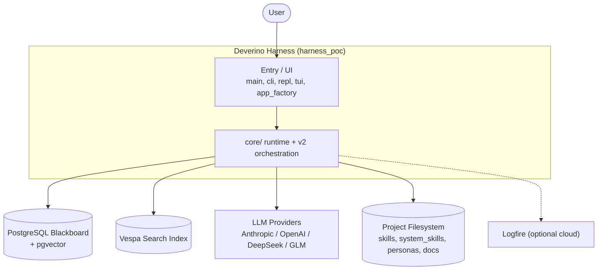

---

## 2. Layered Architecture (L2)

`core/` decomposes into six layers. Dependency direction is generally downward: the entry/UI
layer drives orchestration, which drives the runtime, which uses capabilities and intelligence,
all persisted through the state/events layer. `config`, `permissions`, `logging`, and `observe`
are cross-cutting.

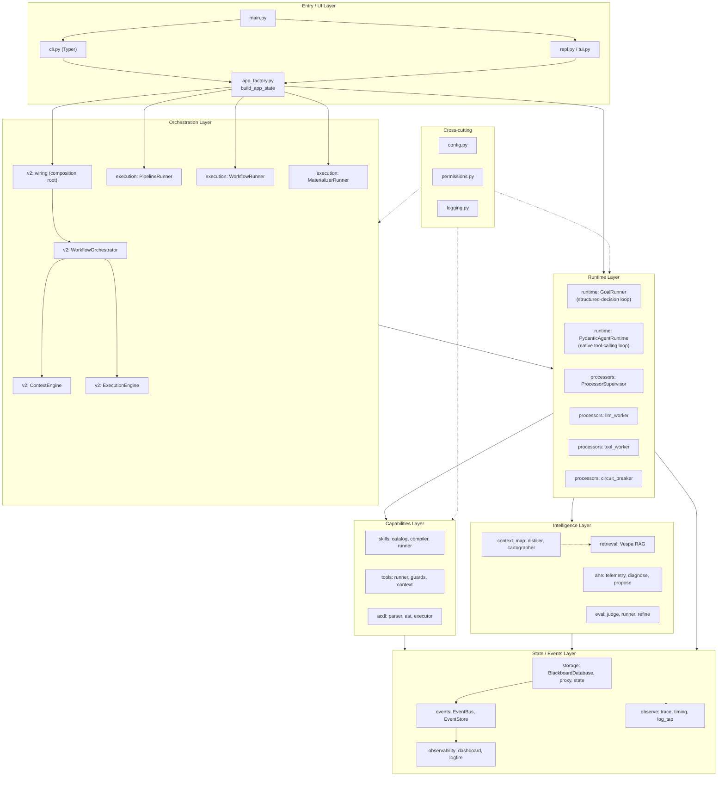

---

## 3. Subsystem Dependency Graph

Concrete import-level dependencies between `core/*` subsystems and `v2`. The capabilities layer
(skills/tools/acdl) is a *leaf-ish* dependency target: runtime imports it, but it imports almost
nothing back. `eval` is the most decoupled; `ahe` is the most coupled.

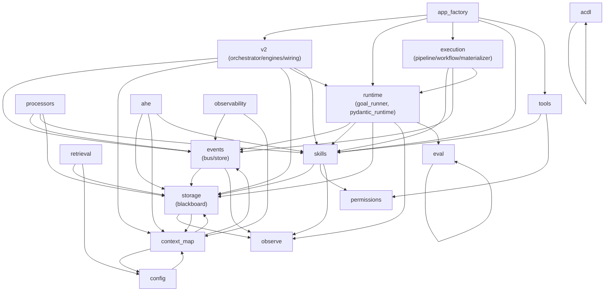

---

## 4. Blackboard Data Model (ER)

All tables are SQLModel. JSON columns become JSONB on PostgreSQL. Migrations are lazy
(`ALTER TABLE` / `create missing` in `BlackboardDatabase.create_tables()`), not Alembic.
`context_map_embeddings` (pgvector, 384-dim) is Postgres-only and created via raw SQL.

```mermaid
erDiagram
    sessions ||--o{ shared_memory : "session_id"
    sessions ||--|| session_state : "session_id"
    sessions ||--o{ state_events : "scope_id"
    sessions ||--|| session_snapshots : "session_id"
    sessions ||--o{ session_messages : "session_id"
    sessions ||--o{ state_proposals : "session_id"
    project_state ||--o{ state_proposals : "merged into"
    document_sources ||--o{ document_chunks : "source_id"
    context_map_cycles ||--|| context_map : "corpus_key"
    context_map_events }o--|| context_map : "corpus_key"
    context_map ||--o{ context_map_embeddings : "corpus_key (pgvector)"

    sessions {
        string session_id PK
        string global_objective
        string status
        datetime created_at
        string active_corpus_key
    }
    shared_memory {
        int id PK
        string session_id FK
        string memory_key
        text data_payload
        datetime created_at
    }
    project_state {
        string project_id PK
        json state_payload
        int version
        datetime updated_at
    }
    session_state {
        string session_id PK
        json state_payload
        int version
        bool dirty
        datetime updated_at
    }
    state_proposals {
        string proposal_id PK
        string session_id FK
        string status
        json proposal_payload
        datetime created_at
        datetime resolved_at
    }
    state_events {
        int id PK
        string scope
        string scope_id
        string event_type
        json payload
        datetime created_at
    }
    context_map_cycles {
        string corpus_key PK
        int cycle_n
        datetime updated_at
    }
    context_map {
        string corpus_key PK
        text map_json
        int token_count
        int version
        datetime last_updated
        text freeze_until
    }
    context_map_events {
        string event_id PK
        string corpus_key
        string session_id
        string event_type
        text payload
        datetime timestamp
        int processed
    }
    session_snapshots {
        string session_id PK
        int last_offset
        json state_payload
        datetime updated_at
    }
    session_messages {
        string session_id PK
        int ordinal PK
        json messages_blob
        datetime created_at
    }
    document_sources {
        string source_id PK
        string uri
        string title
        string kind
        string content_hash
        string status
        int chunk_count
        datetime indexed_at
    }
    document_chunks {
        string chunk_id PK
        string source_id FK
        int chunk_index
        string content_hash
        string vespa_id
        datetime indexed_at
    }
    materialized_context_maps_v2 {
        string project_id PK
        string active_persona
        json pedagogy_snapshot
        json verified_state
        int last_event_id
        datetime updated_at
    }
```

---

## 5. Event System

A single in-process `EventBus` sits over an `EventStore` that persists every event as a row in
`state_events` (the same table that audits direct blackboard mutations). There are two event
*families*: the `BaseEvent` registry (26 agent/skill/LLM/pipeline types) and the
`ContextMapEvent` family (16 materializer types, keyed by string `event_type`).

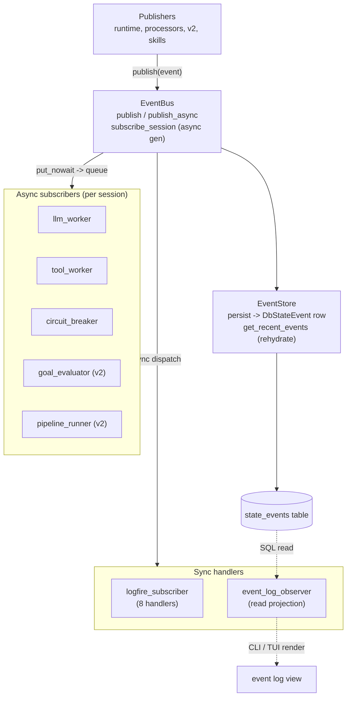

Event families at a glance:

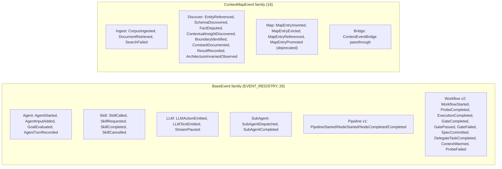

---

## 6. The Two Agent Loops

The codebase carries **two parallel agent-loop implementations** that share the event taxonomy,
the blackboard, `SkillRunner`, and `build_model`, but are not interchangeable.

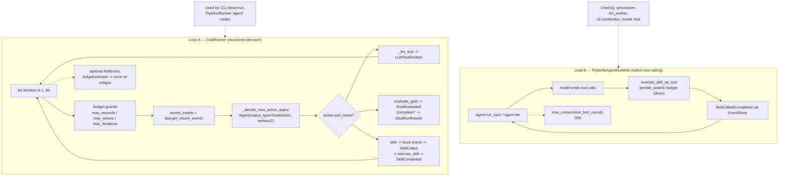

---

## 7. ReAct Agent Loop — v2 `react` mode (sequence)

Four async workers consume the session event stream and form a ReAct loop coordinated entirely
through the bus. `CircuitBreaker` is the kill switch; `GoalEvaluator` flags completion.

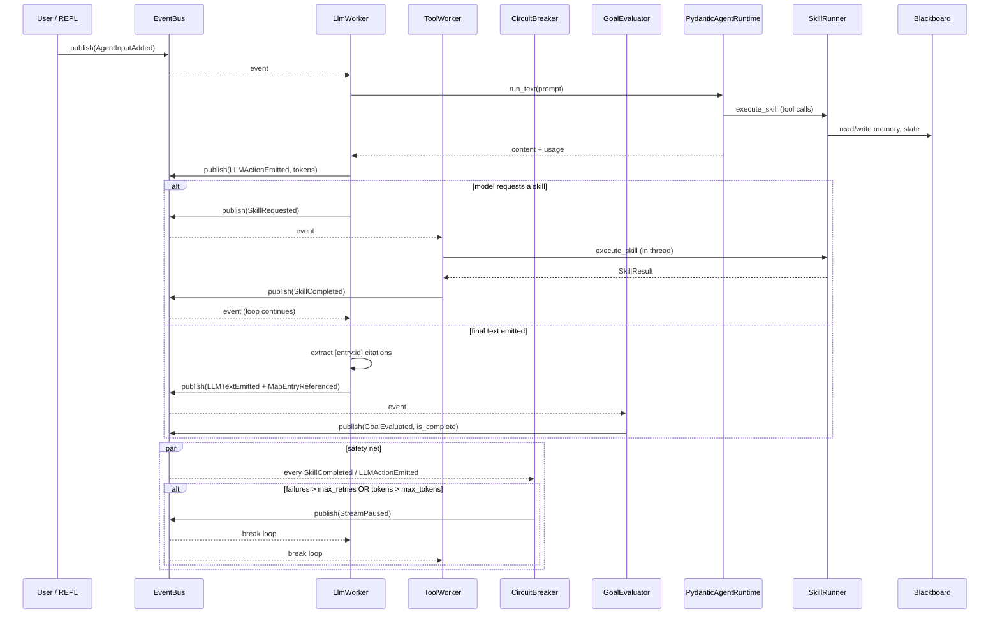

---

## 8. v2 `pipeline` mode — 3-step workflow (sequence)

Event-chained but synchronous inside `bus.publish` callbacks. `PipelineStepRunner` subscribes
to step-boundary events and delegates each step back into `WorkflowOrchestrator`. State mutation
of the materialized context map happens **only on gate pass** (only verified code enters the map).

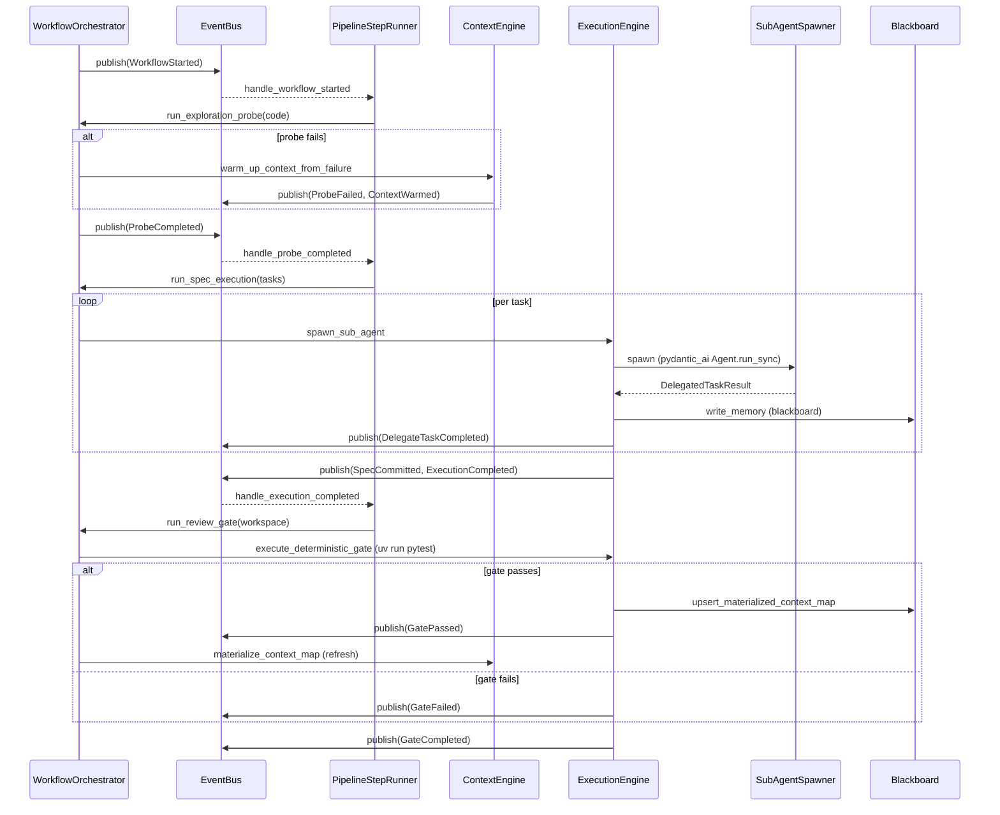

---

## 9. Context Map Materialization Pipeline

Runs **per cycle** as the `context-map-materializer` skill (driven by the background
`MaterializerRunner`). Only one LLM step (the distiller); the cartographer is a pure, deterministic
5-stage function. Output is rendered into the system prompt every turn.

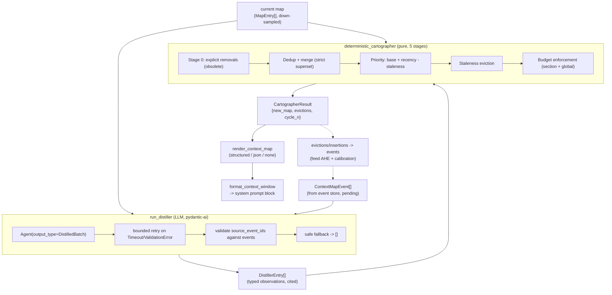

---

## 10. Skill & Tool Execution, Permissions vs Guards

Two complementary, **non-overlapping** enforcement systems. Notable asymmetry: skills invoked as
pydantic-ai tools (`type: skill` via `execute_skill_as_tool`) get `SkillPermissions` +
`BlackboardAccessProxy` but **bypass the guard pipeline entirely**; built-in tools and
skill-backed tools (`type: tool` via `ToolRunner`) get guards.

```mermaid
flowchart TD
    call["LLM tool call / /skill command"]

    subgraph Path1["Path 1: skill as pydantic-ai tool (type: skill)"]
        p1a["execute_skill_as_tool"]
        p1b["SkillRunner.execute_skill"]
        p1c["SkillPermissions.from_yaml"]
        p1d["BlackboardAccessProxy(db, perms)"]
        p1e["SkillContext (project_root/scratch gated)"]
        p1a --> p1b --> p1c --> p1d --> p1e
    end

    subgraph Path2["Path 2: built-in / skill-backed tool (type: tool)"]
        p2a["ToolRunner.execute_tool"]
        p2b["GuardPipeline.validate<br/>(Path, Size, Type, Idempotency, Content, Query)"]
        p2c{"skill-backed?"}
        p2d["handler(**kwargs) or handler(ToolContext)"]
        p2e["SkillRunner.execute_skill<br/>(perms apply here)"]
        p2a --> p2b --> p2c
        p2c -->|no| p2d
        p2c -->|yes| p2e
    end

    call --> Path1
    call --> Path2

    note1["Guards: NOT run on Path 1"]
    note2["Permissions: NOT on built-in tools,<br/>but YES on skill-backed (Path 2 yes)"]
    Path1 -.-> note1
    Path2 -.-> note2
```

Skill lifecycle (discovery -> compile -> preprocess -> execute):

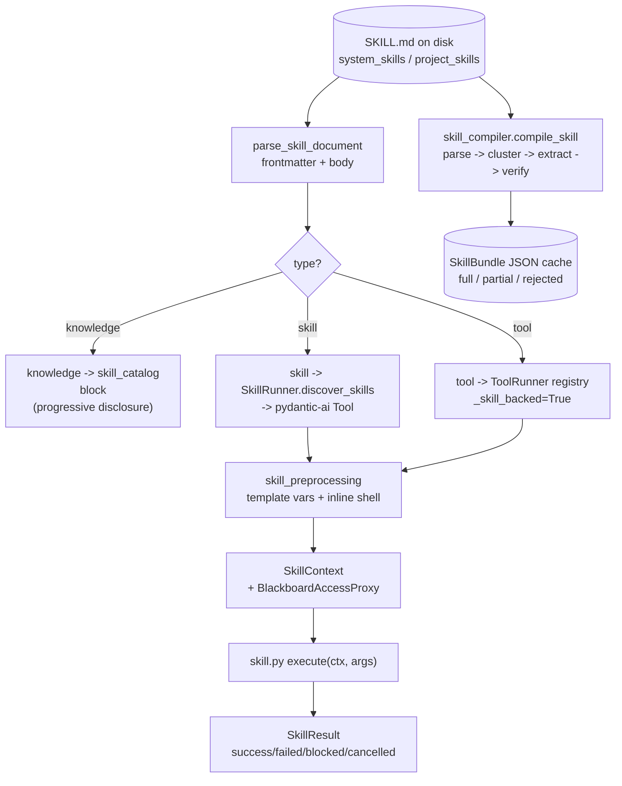

---

## 11. Retrieval / RAG Pipeline

Documents are indexed at startup (auto-index of `docs/`) and on demand (CLI / search skill).
Embeddings are pre-computed at ingest; queries run hybrid (keyword + nearest-neighbor) against
Vespa. Project state is also indexed as keyword-only chunks.

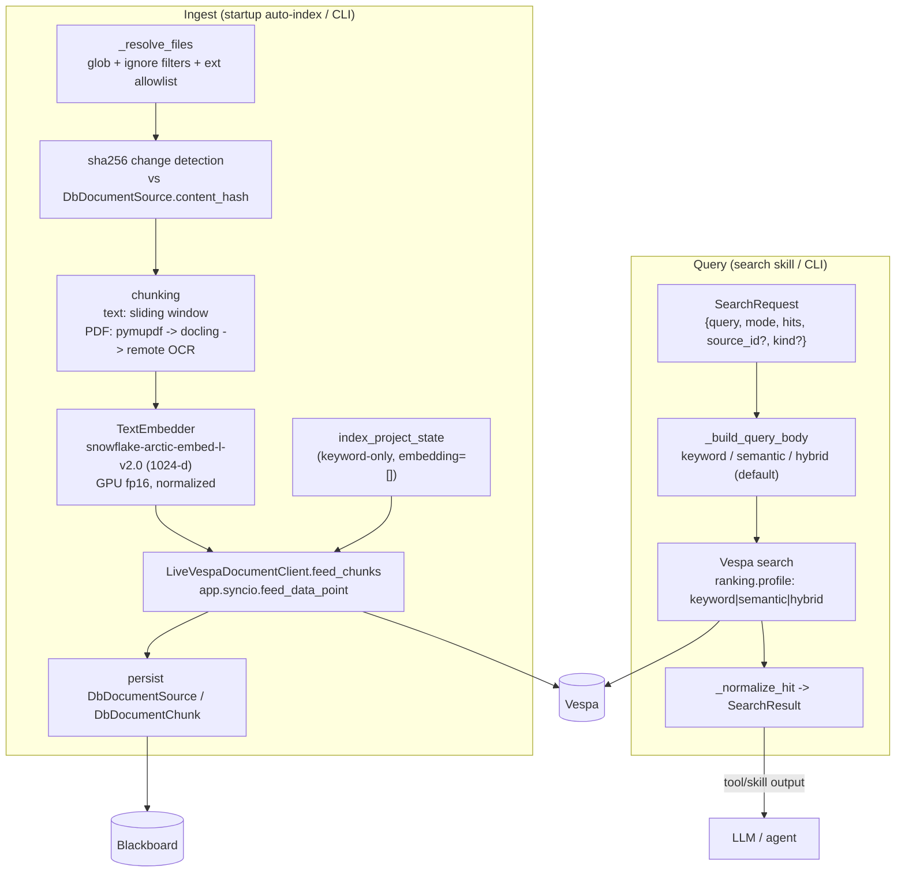

---

## 12. Durable State & Consolidation Flow

Session state accumulates as a `StatePayload` (notes/decisions/next_actions/open_questions/
constraints/changelog + facts). Consolidation is a proposal lifecycle: a session proposes a
snapshot; approval merges it into durable project state. Every mutation writes a `DbStateEvent`.

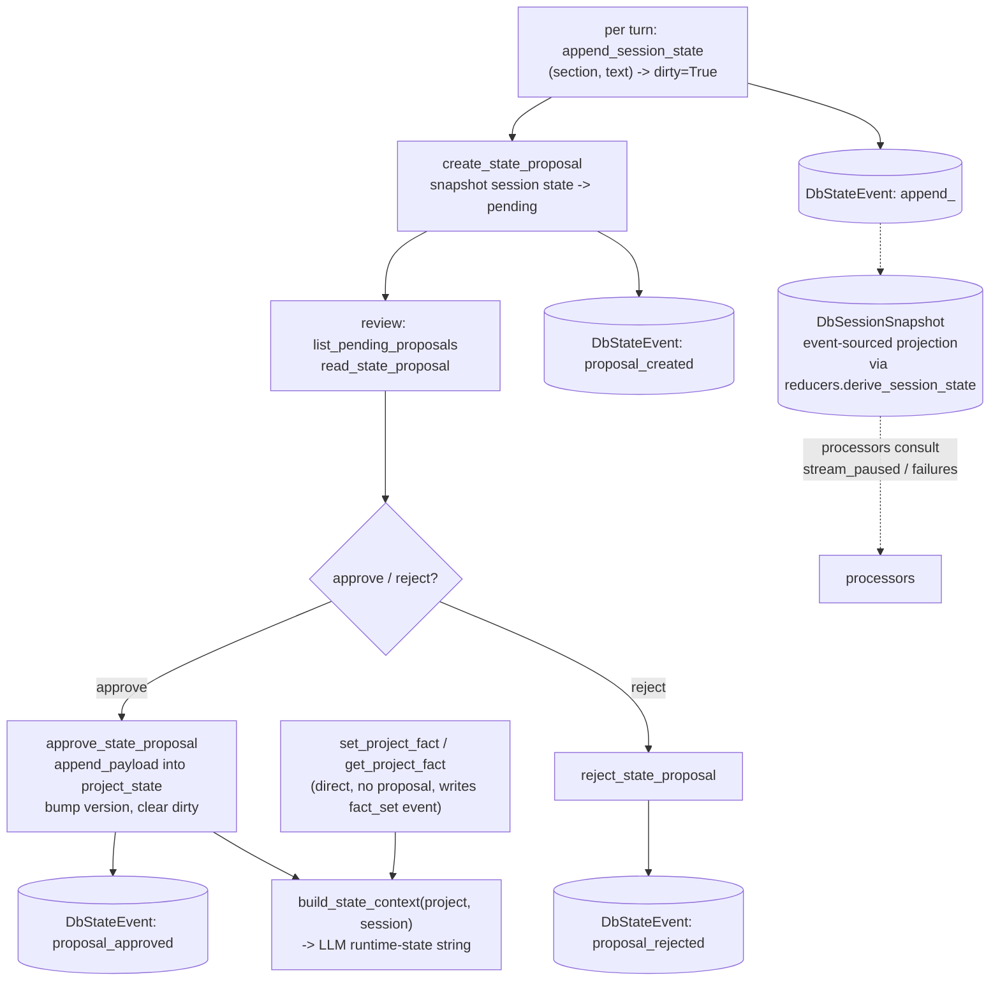

---

## 13. AHE — Autonomous Harness Evolution

A self-improvement loop over the harness itself. Stages 1–3 are implemented (observe → diagnose
→ propose); stages 4–5 (apply / govern) are deferred behind governance tiers (`auto` vs `hitl`).

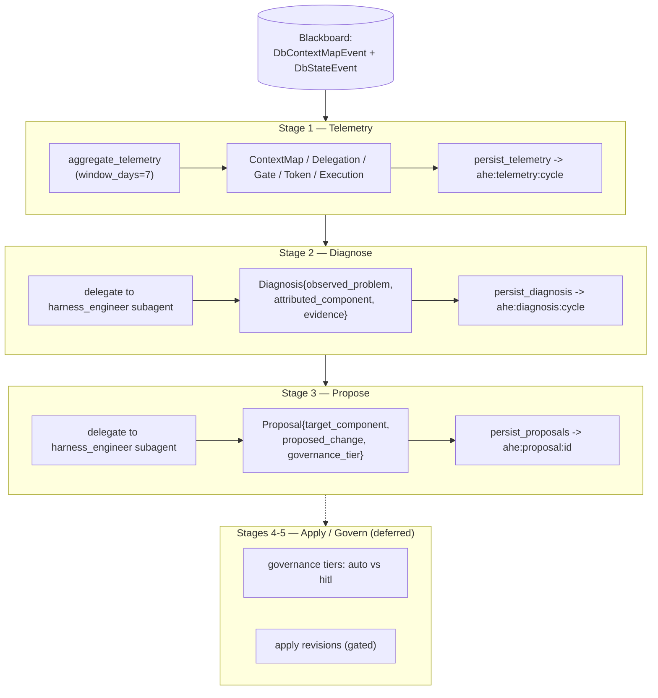

---

## 14. Key Findings & Observations

### Architecture
- **Event-sourced blackboard core.** `EventBus` + `EventStore` persist every event to the
  `state_events` table (also the audit log for direct mutations). Processors/workers are async
  subscribers over `bus.subscribe_session()`. Session state is a snapshot + event-log projection
  (`reducers.derive_session_state`).
- **Two parallel agent loops.** `GoalRunner` (structured-decision LLM returning `GoalAction`,
  used by CLI/pipeline `agent` nodes) and `PydanticAgentRuntime` (native tool-calling, used by
  the `llm_worker` processor and `/mode chat`). They duplicate some concerns (token counting,
  stuck/retry policy).
- **v2 is a layered refactor on top of `core/*`, not a rewrite.** `v2/contracts/` is pure stdlib;
  every engine/handler/subscriber/wiring imports from `harness_poc.core.*` and reuses the v1
  `EventBus`/`EventStore`/`Database`/runtime/skills. Two modes: `react` (4 async workers) and
  `pipeline` (synchronous event-chained 3-step probe→execute→gate). Default `active_mode` is
  `react`, but `build_app_state` defaults `mode="chat"` so v2 is lazily built on `/mode` switch.
- **Context map is the per-turn orientation layer.** Materialized each cycle (distiller = 1 LLM
  call; cartographer = pure 5-stage), rendered into the system prompt every turn. Only verified
  code enters the v2 materialized map (gate-pass gated).
- **Capabilities are a leaf dependency.** `skills`/`tools`/`acdl` import almost nothing from
  other subsystems; runtime pulls them in. `acdl` is fully self-contained (a prompt-composition
  DSL, not an execution language).

### Enforcement model
- **Declarative per-skill permissions** (`SkillPermissions` via `BlackboardAccessProxy` +
  `SkillContext` workspace gating) vs **imperative per-call guards** (`GuardPipeline`:
  Path/Size/Type/Idempotency/Content/Query). Asymmetry: skills-as-tools bypass guards;
  built-in tools have no permissions (skill-backed tools get both).

### Latent issues worth verifying (not fixed per scope)
- `except ValueError, TypeError:` (Python-2 binding semantics, catches only the first type) in
  `runtime/message_history.py` (L34, L232), `tools/tool_runner.py` (`_accepts_context`,
  `_accepts_cancellation`), and `ahe/diagnose.py:85`, `ahe/propose.py:76` — the AHE ones are a
  `SyntaxError` at import time in modern Python and would block those modules from importing.
- `v2/workflow_orchestrator.py` calls `ExecutionEngine.spawn_sub_agent(..., background=...)` but
  the signature is `mode: Literal["foreground","background"]` — would raise `TypeError` on the
  non-empty-tasks path.
- `eval/judge.py` `_llm_rubric_eval` builds the LLM-judge prompt but never calls the model; it
  always falls back to the heuristic rubric. The "LLM-as-judge" is effectively heuristic today.
- `context_map/copt_gate.py` (MiniLM semantic-dedup) is not wired into the deterministic
  cartographer path (which dedups by exact `key`); it is an auxiliary hook.
- `max_background_agents` default differs: `build_execution_engine` (5) vs `ExecutionEngine.__init__` (8).

---

## 15. Presentation

- **In Zed:** this Markdown file renders all Mermaid diagrams inline (open
  `docs/architecture/core-infrastructure-diagrams.md`).
- **For presenting/sharing:** open `docs/architecture/diagrams.html` in any browser — a
  self-contained, styled, section-navigable Mermaid presentation (CDN-loaded, no install),
  printable to PDF.
```
