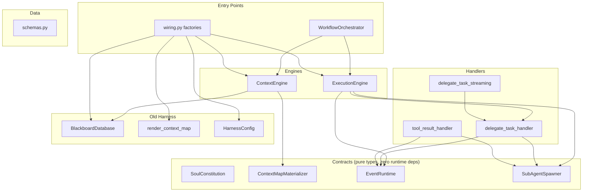

# V2 Architecture

## Context

The v2 module (`harness_poc/v2/`) is an event-sourced layering engine that sits on top of the
existing harness infrastructure. It does not replace the old harness — it wraps its database,
context map, and skill runner behind typed contracts and uses them to drive a three-step
workflow: exploration probe → sub-agent execution → deterministic review gate.

The module references a `planning_specv2.md` spec. The archived spec
(`archive/superpowers/specs/deverino-v2-architecture.md`) describes the intent; this document
describes what the code actually implements as of 2026-06-13.

## Module Map

### Top-level engines and data (6 modules)

| Module | Role | Lines |
|--------|------|-------|
| `__init__.py` | Public API — re-exports all contracts, engines, schemas, handlers, and orchestrator types | 140 |
| `schemas.py` | Pydantic models: `Event` (event stream entry) and `MaterializedContext` (context snapshot) | 42 |
| `context_engine.py` | Builds prompt context window through persona+pedagogy lens; materializes context maps | 387 |
| `execution_engine.py` | Spawns sub-agents (foreground/background) and runs deterministic review gates | 294 |
| `workflow_orchestrator.py` | Three-step pipeline: Probe → Execute → Gate. Coordinates both engines | 493 |
| `wiring.py` | Factory functions and adapters bridging v2 engines to old harness infrastructure | 270 |

### Contracts (6 modules)

| Module | Role | Lines |
|--------|------|-------|
| `contracts/__init__.py` | Re-exports all four contracts | 98 |
| `contracts/soul_constitution.py` | Contract 1: `SoulConstitution` protocol, required sections, integrity validation | 73 |
| `contracts/context_map_pipeline.py` | Contract 2: `ContextMapMaterializer` protocol, `DbContextMap` dataclass, render modes | 89 |
| `contracts/event_runtime.py` | Contract 3: `EventStore`, `EventBus`, `GoalRunner` protocols, status mapping tables | 271 |
| `contracts/sub_agent_spawner.py` | Contract 4: `SubAgentSpawner` protocol, delegated task result/output dataclasses | 151 |
| `contracts/_verify.py` | Import-time smoke test asserting all contracts are importable and types work | 34 |

### Handlers (4 modules)

| Module | Role | Lines |
|--------|------|-------|
| `handlers/__init__.py` | Package docstring | 4 |
| `handlers/delegate_task_handler.py` | A1: Synchronous sub-agent dispatch (7-step pipeline: validate → build spec → spawn → map status → write blackboard → emit event → return) | 228 |
| `handlers/tool_result_handler.py` | A2: Validates and classifies raw tool results into 5 error branches (malformed, timeout, retryable, success, failure) | 223 |
| `handlers/delegate_task_streaming.py` | A3: Async streaming variant of A1 with `on_text` lifecycle callback | 169 |

## Dependency Structure



**Layers (top to bottom):**

1. **Orchestration** — `WorkflowOrchestrator` coordinates the pipeline. Only entry point that calls both engines.
2. **Engines** — `ContextEngine` (context construction) and `ExecutionEngine` (sub-agent dispatch + gates). Depend on contracts and handlers, not on each other.
3. **Handlers** — Thin glue between contracts and the agent loop. Each bridges one specific contract surface.
4. **Contracts** — Pure typed protocols and dataclasses. Zero runtime dependencies. Define the boundary between v2 engines and harness infrastructure.
5. **Data** — `schemas.py` — Pydantic models mapping to PostgreSQL tables. No v2 dependencies.
6. **Adapters** — `wiring.py` — Concrete adapters translating old harness objects into contract-satisfying implementations.

**Notable properties:**

- Contracts are a clean dependency inversion — engines depend on contracts, old harness adapters satisfy them.
- `ExecutionEngine` depends on a handler (`delegate_task_handler`), not just contracts — a layer boundary crossing.
- `delegate_task_streaming` imports from `delegate_task_handler` (shared helpers), so handlers form a small internal dependency cluster.
- `schemas.py` and `contracts/` have zero internal v2 dependencies — they could be extracted to a standalone package.

## Key Abstractions

### Four contracts (Protocol classes)

Each contract is a `@runtime_checkable Protocol` with one primary method:

| Contract | Primary method | Satisfied by |
|----------|---------------|-------------|
| `SoulConstitution` | `.validate()` → raises on missing sections | `build_soul_constitution()` in `wiring.py` — parses `##` headings from SOUL.md, exposes `.sections`/`.get()`/`.validate()` |
| `ContextMapMaterializer` | `.materialize(corpus_path)` → `DbContextMap` | `_HarnessMaterializer` adapter in `wiring.py` wrapping `render_context_map` |
| `SubAgentSpawner` | `.spawn(task_spec)` → `DelegatedTaskResult` | `_HarnessSpawner` adapter — returns stub success, not wired to real LLM loop |
| `EventBus` | `.subscribe()/.publish()` | `_HarnessEventBus` adapter — all methods are `pass` (no-op) |

**Current state:** `ContextMapMaterializer` and `SoulConstitution` have working adapters. `SubAgentSpawner` returns hardcoded success. `EventBus` is a no-op.

### Status mapping (three-layer translation)

The contracts define a canonical status mapping that flows through three representations:

```
GoalRunner status → DelegatedTaskResult status → external label
─────────────────    ─────────────────────────    ─────────────
"completed"        → "success"                  → "completed"
"failed"           → "failed"                   → "failed"
"blocked"          → "failed"                   → "blocked"
"timeout"          → "failed"                   → "failed"
```

The `SubAgentSpawner` only understands binary success/failed. The `map_delegated_to_external()` function recovers the original nuance (e.g., "blocked") by accepting an optional `original_goal_status` parameter.

### DbContextMap

The rendered output of the context map pipeline. Contains: `map_id`, `rendered` text, `render_mode`, `source_paths`, `token_count`, `stages_run`. This is what `ContextEngine` injects into the prompt after filtering through the persona+pedagogy lens.

## Request Lifecycle

A concrete flow through the three-step pipeline:

### Step 1: Fail-Fast Probe (`run_exploration_probe`)

1. Orchestrator writes spec code to a temp file and runs it via `subprocess.run` with a configurable timeout (default 30s).
2. On failure (non-zero exit): extracts semantic constraints from stderr/traceback (missing imports, type errors, IO boundaries, assertion violations).
3. Calls `ContextEngine.warm_up_context_from_failure()` which commits `PROBE_FAILED` and `CONTEXT_WARMED` events to the database and persists a materialized context map snapshot with discovered constraints.
4. Returns `ProbeResult` with exit code, stdout/stderr, and discovered constraints.

### Step 2: Spec Execution (`run_spec_execution`)

1. Orchestrator iterates over spec-defined sub-agent tasks.
2. For each task: calls `ExecutionEngine.spawn_sub_agent()` which delegates to `_handle_delegate_task` (handler A1).
3. The handler validates arguments (requires `persona` + `objective`), builds a `task_spec`, calls `SubAgentSpawner.spawn()`, maps the binary result through the status tables, writes to blackboard, and emits a `delegate_task_completed` event.
4. Background mode: tasks register in the engine's pool and return immediately with a `task_id` for polling. Pool capped at `max_background_agents` (default 5).
5. Returns `ExecutionResult` with per-agent results and aggregate pass/fail.

### Step 3: Deterministic Review Gate (`run_review_gate`)

1. Orchestrator calls `ExecutionEngine.execute_deterministic_gate()`.
2. The engine runs `uv run pytest --tb=short -q` (falls back to `python -m pytest` if `uv` is unavailable) with a 120s timeout.
3. On pass: persists a `GATE_PASSED` event, updates the materialized context map with verified state (test count, output summary), and refreshes the context map via `ContextEngine.materialize_context_map()`.
4. On failure: persists `GATE_FAILED`, raises `GateFailureError`.
5. The principle: "only verified code enters the materialized context map."

## Old-Harness Touchpoints

V2 depends on these specific surfaces from the pre-v2 harness:

| Surface | Used by | How |
|---------|---------|-----|
| `BlackboardDatabase` | `context_engine.py`, `execution_engine.py`, `wiring.py` | All database operations: `get_context_map`, `get_cycle`, `append_context_event`, `upsert_materialized_context_map`, `write_memory` |
| `render_context_map` | `wiring.py:_build_materializer_adapter` | Wrapped behind the `ContextMapMaterializer` contract |
| `HarnessConfig` / `HarnessPaths` | `wiring.py` | `config.paths.personas`, `config.project_root` for pedagogy path resolution |
| Filesystem paths | `wiring.py`, `context_engine.py` | `personas/<id>.md`, `.agents/skills/developer-pedagogy/SKILL.md` |
| `subprocess` | `execution_engine.py`, `workflow_orchestrator.py` | Running `pytest` for the gate, running sandbox code for the probe |

## Intent vs. Reality

Comparing the archived `deverino-v2-architecture.md` spec against the actual code:

| Spec says | Code does | Gap |
|-----------|-----------|-----|
| Four contracts with Phase 1 implementations | Contracts exist and are well-typed, but 3 of 4 adapters are stubs | `SubAgentSpawner` adapter returns hardcoded success; `EventBus` adapter is no-op; `SoulConstitution` has no adapter |
| "Event-sourced layering" | Events are written via `db.append_context_event()` directly, not through `EventBus.publish()` | The `EventBus` protocol exists but isn't the actual event path |
| "Persona-driven materialization" | `ContextEngine` loads persona files and combines with pedagogy — but the "unified lens" is string concatenation, not semantic filtering | The filtering step (`_unify_persona_pedagogy`) is a format operation, not content-aware |
| `SubAgentSpawner` spawns real LLM sub-agents | Stub returns `"note": "Sub-agent spawned via harness adapter (stub)"` | No actual LLM loop is invoked for sub-agents |
| Pipeline stages: ingest → index → retrieve → assemble → render | Adapter hardcodes `stages_run=["ingest", "index", "retrieve", "assemble", "render"]` | Stages are claimed but not individually implemented — the adapter wraps a single `render_context_map` call |
| `planning_specv2.md` referenced throughout | No `planning_specv2.md` file exists in the codebase or docs | The spec is external/uncommitted or was the archived `deverino-v2-architecture.md` |

## Known Gaps & Next Steps

- **`planning_specv2.md` is lost.** Module docstrings still reference it. The archived
  `deverino-v2-architecture.md` is the closest surviving spec. Infer from current
  implementation.

- **2 of 4 contract adapters are stubs.** `SubAgentSpawner` and `EventBus` need real
  implementations. `SoulConstitution` is now wired via `build_soul_constitution()`.
  `ContextMapMaterializer` was already wired.

- **Probe step is untested.** The orchestrator writes spec code to a temp file and
  runs it via `subprocess`. Needs validation that this works end-to-end.

- **`MaterializedContext` Pydantic model appears unused.** `context_engine.py` writes
  verified state as a raw dict, not through the model defined in `schemas.py`.
  Investigate whether the model should be wired in or removed.

- **`v2/tests/` contains gate tests, not validation targets.** The deterministic gate
  runs `pytest` on the whole project. Once v2 is wired into the harness, consolidate
  tests into a single test directory.
