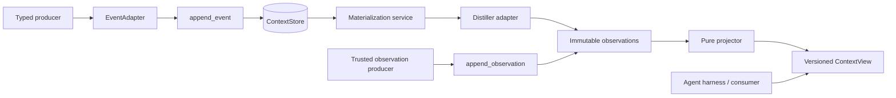

# Context Backbone Refactor and Discovery Spec

**Date:** 2026-07-11
**Status:** Draft for discovery and refactor planning
**Scope:** Component A only

## 1. Objective

Extract Deverino's context-map architecture into a reusable context backbone. The backbone
accepts typed producer events or normalized observations, retains their provenance, and builds a
bounded materialized context view that remains consistent across sessions.

This is a refactor and discovery spec, not an implementation plan. It defines the target boundary,
identifies the current code that appears to belong on either side, and records the questions that
must be answered against the running POC before files are moved.

## 2. System Boundary

The reusable system is divided into three components:

- **A: Context backbone.** Durable evidence, immutable observations, deterministic projection,
  context rendering, and replay.
- **B: Agent harness.** A subscriber to A that produces events and consumes context views.
- **C: Agent platform.** The eventual composition of agents, workflows, pipelines, skills,
  scheduling, evaluation, and interfaces.

This spec covers A. A is event-sourced, but it is not coupled to Deverino's `EventBus`. Event
transport, scheduling, and automatic closed-loop invocation belong to B or C.

## 3. Design Principles

1. **Typed producers remain authoritative.** Producer event classes do not inherit from an A base
   class and are not flattened at the public boundary.
2. **Raw evidence and interpretation are distinct.** Raw events and derived observations are both
   immutable records.
3. **Projection is deterministic.** Context views replay from stored observations without invoking
   a model.
4. **Scopes are caller-defined.** `scope_key` is an opaque slug; A does not model projects,
   sessions, personas, agents, or tenants.
5. **Policy is configurable.** A ships useful observation types, sections, and ranking defaults,
   but hosts may replace them.
6. **Invocation is explicit.** A exposes `materialize(scope_key)`. Hosts may call it manually or
   through configurable closed-loop trigger policies.
7. **Storage is replaceable.** The domain and projection algorithm do not depend on PostgreSQL,
   SQLModel, PydanticAI, or Deverino's blackboard.

## 4. Architecture

Use a compact hexagonal kernel: one public facade, a pure domain and projector, one application
service, and narrow storage and distillation ports.



Proposed package surface:

```text
context_backbone/
  model.py       # EventEnvelope, Observation, ContextEntry, ContextView
  policy.py      # taxonomy, sections, ranking, staleness, budgets
  projector.py   # pure observation-to-view transition
  service.py     # append, distill, materialize, read, rebuild
  ports.py       # ContextStore, EventAdapter, Distiller
  render.py      # bounded text and structured representations
  adapters/
    sqlmodel.py  # initial PostgreSQL/SQLModel store
    pydantic_ai.py
```

This is a target responsibility map, not a required file-per-concept decomposition. During
implementation, keep concepts together when splitting them would add indirection without reducing
coupling.

## 5. Canonical Records

### 5.1 EventEnvelope

The persisted representation of a producer-owned typed event:

```text
id
scope_key
event_type
schema_version
payload
occurred_at
producer
metadata
```

`event_type` and `schema_version` select a compatible adapter. Unknown event types remain valid
stored evidence and are not distilled until a compatible adapter and distiller are mounted.

### 5.2 Observation

An immutable normalized fact used by the projector:

```text
id
scope_key
kind
summary
source_event_ids
created_at
metadata
```

Raw events may produce zero or more observations. Trusted callers may append observations directly.
Observation IDs make both paths idempotent.

### 5.3 ContextEntry

The current materialized representation of a stable context key:

```text
key
kind
section
summary
source_observation_ids
priority
first_seen_at
updated_at
first_seen_cycle
last_seen_cycle
materialization_count
token_estimate
```

### 5.4 ContextView

```text
scope_key
version
cycle
entries
policy_revision
updated_at
```

The view is disposable and rebuildable from observations. Agent, session, persona, and workflow
identifiers are optional metadata rather than backbone concepts.

## 6. Typed Event Mounting

Typed producers mount through an adapter rather than inheritance:

```python
class EventAdapter[T](Protocol):
    def encode(self, event: T, scope_key: str) -> EventEnvelope: ...
    def decode(self, envelope: EventEnvelope) -> T: ...
```

The initial Deverino adapter handles the existing Pydantic `BaseEvent` hierarchy. Other hosts may
mount dataclasses, Pydantic models, protobuf messages, or plain mappings. The adapter preserves the
producer's type discriminator and schema version.

Distillers register for compatible event types. When an adapter is available they may receive the
decoded typed event; the stored envelope remains the durable evidence.

## 7. Public API

```python
backbone.append_event(scope_key, event, adapter)
backbone.append_observation(observation)
backbone.materialize(scope_key)
backbone.get_view(scope_key)
backbone.render(scope_key, format="text")
backbone.rebuild(scope_key)
```

Mounted dependencies:

```text
ContextStore
EventAdapter[T]
Distiller[T]
ContextPolicy
```

The facade is the supported application API. Appends are idempotent. `materialize()` converts
pending raw events into immutable observations, then projects unconsumed observations. `rebuild()`
creates a new projection from retained observations and never redistills raw evidence.

## 8. Materialization and Consistency

Materialization for one scope follows this sequence:

1. Load the current view and its version.
2. Load pending raw events and unprojected direct observations.
3. Decode and distill supported raw events.
4. Append derived observations idempotently.
5. Apply the pure projector to all newly available observations.
6. Atomically commit the new view and consumption checkpoints using the loaded version.

The store uses optimistic concurrency. A commit succeeds only when `expected_version` still matches.
A conflict is returned explicitly; A does not hide an unbounded retry loop. The caller may retry the
whole materialization command against the newer view.

Derived observations are committed before or atomically with their projection checkpoint so a
worker crash cannot require nondeterministic redistillation. The exact transaction boundary must be
validated against the current database implementation during discovery.

## 9. Triggering

A contains no background worker. It exposes explicit materialization. B or C may configure trigger
policies such as:

- after each turn;
- after a threshold of pending events;
- before a context read;
- on an interval;
- at a closed-loop transition or verification gate.

Every policy invokes the same `materialize(scope_key)` operation. This keeps automatic systems
possible without adding hidden lifecycle behavior to A.

## 10. Errors and Recovery

The public API distinguishes these outcomes:

- duplicate append: successful no-op;
- unsupported event type or schema: evidence retained, event remains pending;
- distillation failure: no projection checkpoint advances for the affected event;
- invalid observation: rejected at the trust boundary;
- optimistic conflict: explicit conflict result, safe to retry;
- render failure: stored view remains valid;
- corrupt persisted record: fail visibly with record identity; do not silently discard it.

One poison event must not permanently block unrelated supported events in the same scope. Discovery
must determine whether processing checkpoints are per event or currently batch-wide and specify the
smallest safe correction.

## 11. Current POC Classification

### Retain as the domain kernel

- `harness_poc/core/context_map/schema.py`
- `harness_poc/core/context_map/sections.py`
- `harness_poc/core/context_map/cartographer.py`
- `harness_poc/core/context_map/render.py`
- `harness_poc/core/context_map/config.py`

These files contain the existing typed records, deterministic classification, projection, budget,
staleness, and rendering behavior. Their dependencies and Deverino-specific assumptions still need
line-by-line verification.

### Adapt behind ports

- `skills/context-map-materializer/skill.py`: promote its orchestration into A's materialization
  service; retain a thin skill adapter only if C still needs it.
- `harness_poc/core/context_map/distiller.py`: initial model-backed `Distiller` adapter.
- Context-map methods in `harness_poc/core/storage/database.py`: initial `ContextStore` adapter.
- Context-map tables in `harness_poc/core/storage/models.py`: initial SQLModel persistence adapter.
- `harness_poc/core/execution/materializer_runner.py`: move outside A and reduce to an optional host
  trigger.

### Exclude from A

- `harness_poc/core/events/event_bus.py` and general runtime events: B/C transport.
- `harness_poc/app_factory.py`: B prompt assembly and context consumption.
- `harness_poc/v2/context_engine.py`: B/C consumer behavior.
- `harness_poc/core/runtime/pydantic_runtime.py`: B producer behavior.
- workflows, pipelines, skills, agents, TUI, CLI, dashboard, and AHE: C concerns.
- `harness_poc/core/context_map/calibrate.py` and CopT embeddings: optional policy experiments until
  their value and coupling are measured.

### Reconcile before extraction

`DbContextMap` and `DbMaterializedContextMap` represent competing context projections. Discovery
must trace all readers and writers, identify whether they encode different required semantics, and
select one canonical projection model. Do not preserve both merely because both exist.

## 12. Discovery Work

Before planning implementation:

1. Trace every context-map event producer and classify its event type, scope selection, and adapter.
2. Trace every materialized-map consumer and document the fields and render forms it actually uses.
3. Verify the current transaction boundaries for event append, derived observation write, map write,
   and processed checkpoints.
4. Determine whether failed or unknown events block a batch and how they are retried.
5. Compare `DbContextMap` with `DbMaterializedContextMap` and remove semantic duplication from the
   target model.
6. Identify Deverino imports in the proposed domain kernel and decide whether each belongs in policy,
   an adapter, or B/C.
7. Inventory existing tests that prove ranking, eviction, replay, provenance, and prompt rendering.
8. Run one real session through the current system and capture the event-to-view lineage as a
   behavioral baseline.

Each discovery result should update this spec before an implementation plan is written.

## 13. Verification Contract

The extracted design requires focused checks for:

- typed event round-trip through its adapter;
- idempotent raw-event and observation append;
- raw event to persisted derived observation lineage;
- deterministic rebuild from observations without a model call;
- configurable taxonomy and section policy;
- token-budget and staleness behavior preserved from the current projector;
- optimistic conflict with no lost observations;
- crash recovery between distillation and projection;
- unsupported event retention without blocking supported events;
- isolation between arbitrary caller-defined scope keys;
- current Deverino context output remaining equivalent for a captured baseline.

## 14. Non-Goals

- A general event bus or event-processing framework.
- Worker, scheduler, or service lifecycle management.
- Agent loops, model-provider selection, tool execution, or prompt composition.
- A fixed tenant/project/session/agent hierarchy.
- Dynamic cross-scope joins inside the backbone.
- Preserving every POC experiment in the reusable package.
- Moving files before the discovery work establishes their actual runtime role.

## 15. Exit Criteria for Discovery

Discovery is complete when:

- every current producer and consumer is assigned to A, B, or C;
- the canonical event, observation, and view schemas cover current runtime behavior;
- the two materialized-map models are reconciled;
- the initial adapter boundaries are proven against current call sites;
- transaction and retry semantics are explicit;
- a behavioral baseline and focused regression set exist;
- the spec contains no unresolved architectural decision required for implementation planning.
